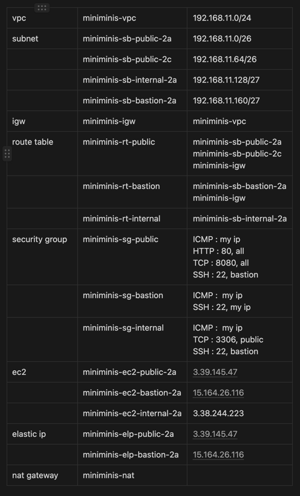

<p align="center">
    
</p>
<p align="center">
  
  
  <a href="https://edu.nextstep.camp/c/R89PYi5H" alt="nextstep atdd">
    
  </a>
  
</p>

<br>

# 인프라공방 샘플 서비스 - 지하철 노선도

<br>

## 🚀 Getting Started

### Install
#### npm 설치
```
cd frontend
npm install
```
> `frontend` 디렉토리에서 수행해야 합니다.

### Usage
#### webpack server 구동
```
npm run dev
```
#### application 구동
```
./gradlew clean build
```
<br>

## 미션

* 미션 진행 후에 아래 질문의 답을 README.md 파일에 작성하여 PR을 보내주세요.

### 0단계 - pem 키 생성하기

1. 서버에 접속을 위한 pem키를 [구글드라이브](https://drive.google.com/drive/folders/1dZiCUwNeH1LMglp8dyTqqsL1b2yBnzd1?usp=sharing)에 업로드해주세요

2. 업로드한 pem키는 무엇인가요.
- key-miniminis.pem

### 1단계 - 망 구성하기
1. 구성한 망의 서브넷 대역을 알려주세요
- 대역 : 




2. 배포한 서비스의 공인 IP(혹은 URL)를 알려주세요

- Public IP : 3.39.145.47
- URL : http://subway.infrastudy.kro.kr


---

### 2단계 - 배포하기
1. TLS가 적용된 URL을 알려주세요

- URL : https://infrastudy.kro.kr/

---

### 3단계 - 배포 스크립트 작성하기

```shell
#!/bin/bash

## 변수 설정

txtrst='\033[1;37m' # White
txtred='\033[1;31m' # Red
txtylw='\033[1;33m' # Yellow
txtpur='\033[1;35m' # Purple
txtgrn='\033[1;32m' # Green
txtgra='\033[1;30m' # Gray

BRANCH='miniminis'

## 함수 설정
### 저장소 변경사항 체크
function check_df() {
  git fetch

  master=$(git rev-parse $BRANCH)
  remote=$(git rev-parse origin/$BRANCH)
  echo -e ">>>>> master : $master"
  echo -e ">>>>> remote : $remote"

  if [[ $master == $remote ]];
	then
    return 1
  fi

	return 0
}


### 저장소 pull
function pull() {
	echo -e "${txtgrn}>>>>> Pull Request 🏃♂️ 통해 코드를 업데이트 합니다. (from origin $BRANCH) ${txtrst}"
  git pull origin $BRANCH

	echo -e "${txtgrn}>>>>> origin $BRANCH 으로부터 성공적으로 Pull 완료되었습니다. ${txtrst}"
}

### 현재 process 조회 후 종료
function killProcess() {
	pid=$(pgrep -f subway-0.0.1-SNAPSHOT.jar)
  echo -e "${txtgrn}>>>>> 진행 중인 process($pid)가 존재하므로 종료합니다. ${txtrst}"

	if [[ -n "$pid" ]];
	then
  	echo -e "${txtgrn}>>>>> 진행 중인 process($pid)가 존재하므로 종료합니다. ${txtrst}"
	  kill -15 $pid
	  echo -e "${txtgrn}>>>>> 프로세스가 정상적으로 종료되었습니다. ${txtrst}"
	fi

  echo -e "${txtgrn}>>>>> 진행 중인 process가 없습니다. ${txtrst}"
}


## 배포 스크립트
echo -e "${txtylw}=======================================${txtrst}"
echo -e "${txtgrn}   << subway의 배포를 시작합니다 🧐 >>${txtrst}"
echo -e "${txtylw}=======================================${txtrst}"

echo -e "${txtgrn}>>>>> 원격 저장소의 변경사항을 체크합니다.${txtrst}"

check_df

if [[ $? -eq 1 ]];
then
  echo -e ">>>>> [$(date)] 업데이트 내용이 없으므로 프로그램을 종료합니다. 😫"
  exit 0
fi

echo -e ">>>>> [$(date)] 업데이트 내용이 있습니다. "
pull

echo -e "${txtgrn}>>>>> 현재 진행 중인 process가 있는지 조회하고 있다면, 종료합니다. ${txtrst}"
killProcess

echo -e "${txtgrn}>>>>> 새로운 앱 빌드를 실행합니다.${txtrst}"
./gradlew clean build -x test

echo -e "${txtgrn}>>>>> 빌드한 앱을 시작합니다. 실행 환경을 선택해주세요(local/prod) ${txtrst}"
read env

if [[ "$env" = "prod" ]];
then
  echo -e "${txtgrn}>>>>> 운영 환경에서 앱 배포를 시작합니다.${txtrst}"
elif [[ "$env" = "local" ]];
then
  echo -e "${txtgrn}>>>>> 로컬 환경에서 앱 배포를 시작합니다.${txtrst}"
else
  echo -e "${txtgrn}>>>>> 존재하지 않는 환경입니다. 프로세스를 종료합니다. ${txtrst}"
fi

echo -e "${txtylw}=======================================${txtrst}"
echo -e "${txtgrn}<< subway의 배포가 성공적으로 완료되었습니다 🎉>>${txtrst}"
echo -e "${txtylw}=======================================${txtrst}"

```


